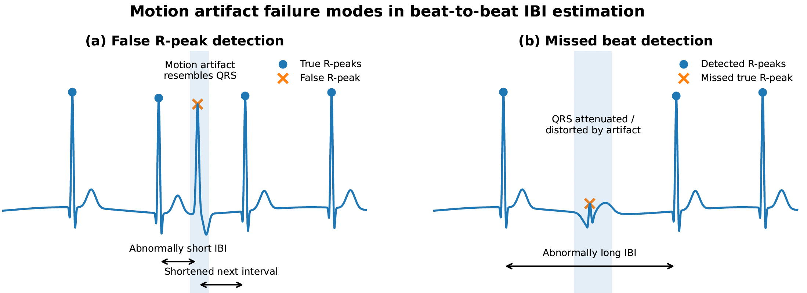
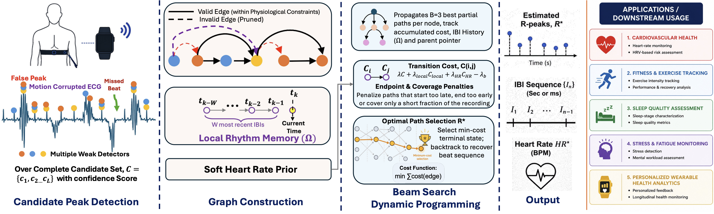

# ARTA (Artifact-Robust Temporal Alignment)

This repository contains the minimal code, sample data, and result tables needed to reproduce and inspect the ECG-only **ARTA (Artifact-Robust Temporal Alignment)** method for R-peak, IBI, and heart-rate estimation under motion artifact.

## Method Overview

ARTA is designed for ECG recordings corrupted by motion artifact, where standard R-peak detectors can fail in two ways: artifact may create false QRS-like peaks, and true QRS complexes may be distorted or missed. These errors produce abnormal IBI estimates and unstable heart-rate estimates.



**Fig. 1. Motion-induced failure modes.** Motion artifact can introduce false R-peaks that create abnormally short IBIs, or hide true R-peaks and create abnormally long IBIs.

ARTA addresses these errors by treating multiple ECG detectors as weak evidence rather than final decisions. Candidate R-peaks are merged into an over-complete set, organized as nodes in a directed acyclic graph, and decoded with beam-search dynamic programming to recover the most physiologically consistent beat sequence.



**Fig. 3. ARTA framework.** Multiple ECG detectors generate candidate R-peaks; ARTA builds a physiologically constrained graph, applies local rhythm memory and a soft heart-rate prior, and selects the minimum-cost path to estimate R-peaks, IBIs, and heart rate.

ARTA builds an over-complete ECG R-peak candidate set, formulates candidate selection as a directed acyclic graph problem, and uses dynamic programming with beam search to recover a physiologically consistent beat sequence.

## Dashboard


Public dashboard link:

```text
https://arta.ghasemzadeh.com/
```


## Main Result

Overall state-of-the-art comparison against BPM0 window-level ground truth:

| Method | MAE (BPM) | RMSE (BPM) | Pearson r | W+-5 BPM |
|---|---:|---:|---:|---:|
| **ARTA** | **1.796** | **5.212** | **0.977** | **92.38%** |
| Aygun et al. [3] | 14.858 | 19.889 | 0.745 | 28.34% |
| WFDB-GQRS | 9.765 | 23.847 | 0.451 | 76.73% |
| Tiramisu [2] | 5.787 | 13.021 | 0.853 | 72.87% |
| WFDB-XQRS | 3.929 | 10.275 | 0.920 | 84.18% |
| Pan-Tompkins | 6.196 | 11.478 | 0.893 | 66.73% |
| Wavelet | 11.275 | 16.646 | 0.731 | 41.73% |
| Majority (2/3) | 6.045 | 11.838 | 0.878 | 70.11% |
| Union-NMS | 63.068 | 79.565 | 0.454 | 19.65% |

The table is also saved as:

```text
results/tables/paper_table_3_state_of_art_overall.csv
```

Beat-level summary metrics are saved as:

```text
results/tables/paper_table_4_beat_level_overall.csv
```

## Repository Structure

```text
arta/                         # ARTA source code
scripts/run_sample_arta.py    # Small sample run command
sample_data/                  # Compact prepared dataset subset
templates/                    # 60-second CSV upload examples
results/tables/               # Main paper/result CSV tables
results/plots/                # Key exported plots
requirements.txt              # Python dependencies
pyproject.toml                # Python package metadata
```

## Install

Install the package locally from this repository:

```bash
python -m venv .venv
source .venv/bin/activate
pip install -e .
```

Python 3.11 is recommended.

After installation, verify the package import and command-line tool:

```bash
python -c "from arta import estimate_rpeaks_arta; print('ARTA import works')"
arta-run --help
```

You can also install only the runtime dependencies with:

```bash
pip install -r requirements.txt
```

## Run ARTA On The Included Sample

The included sample contains one prepared ECG record, `DATA_01_TYPE01`, with one clean file and four noisy SNR variants.

Run ARTA on the `-2 dB` sample:

```bash
python scripts/run_sample_arta.py --snr -2
```

Run another SNR:

```bash
python scripts/run_sample_arta.py --snr 0
python scripts/run_sample_arta.py --snr 6
python scripts/run_sample_arta.py --snr 12
```

Outputs are written to:

```text
outputs/sample_arta/
```

## Run The Full ARTA Pipeline

After downloading/preparing the full dataset locally, place it in the same Step-1 processed format:

```text
full_data/processed_dataset/
  clean_records/
  noisy_records/
    snr_neg2db/
    snr_0db/
    snr_2db/
    snr_4db/
    snr_6db/
    snr_12db/
```

Then run:

```bash
arta-run \
  --processed-dir full_data/processed_dataset \
  --output-dir outputs/arta_full \
  --beam-width 3 \
  --omega-size 5 \
  --sigma-hr-ms 180
```

To limit the run to selected SNR levels:

```bash
arta-run \
  --processed-dir full_data/processed_dataset \
  --output-dir outputs/arta_snr_subset \
  --snrs -2 0 6 12
```

The module form is also supported:

```bash
python -m arta.arta --help
```

## Sample Dataset

This repository intentionally includes only a small sample dataset to keep the repository lightweight. The full dataset should be downloaded and processed locally by users.

Included prepared files:

```text
sample_data/processed_dataset/clean_records/DATA_01_TYPE01_clean.npz
sample_data/processed_dataset/noisy_records/snr_neg2db/DATA_01_TYPE01_snr_neg2db.npz
sample_data/processed_dataset/noisy_records/snr_0db/DATA_01_TYPE01_snr_0db.npz
sample_data/processed_dataset/noisy_records/snr_6db/DATA_01_TYPE01_snr_6db.npz
sample_data/processed_dataset/noisy_records/snr_12db/DATA_01_TYPE01_snr_12db.npz
```

CSV upload examples:

```text
templates/sample_DATA_01_TYPE01_60s_ecg.csv
templates/sample_DATA_02_TYPE02_60s_ecg.csv
templates/sample_DATA_03_TYPE02_60s_ecg.csv
```

## Python Package

The ARTA package is available on TestPyPI for installation testing:

```text
https://test.pypi.org/project/arta/0.1.0/
```

Install the TestPyPI package with:

```bash
python -m pip install --index-url https://test.pypi.org/simple/ --extra-index-url https://pypi.org/simple/ arta==0.1.0
```

Verify the import and command-line entry point:

```bash
python -c "from arta import estimate_rpeaks_arta; print('ARTA import works')"
arta-run --help
```

Run ARTA after installing the package:

```bash
arta-run \
  --processed-dir sample_data/processed_dataset \
  --output-dir outputs/sample_arta \
  --snrs -2 0 6 12
```

The package name `arta` on the main PyPI index is already used by another project, so the command above intentionally points to TestPyPI. For manuscript reproducibility, users may also install directly from this repository:

```bash
python -m pip install git+https://github.com/shovito66/arta.git
```

## Citation

Please cite the paper when using this code. Placeholder BibTeX:

```bibtex
@article{soumma_arta_ecg_2026,
  title   = {Artifact-Robust Temporal Alignment for Robust ECG Inter-Beat Interval Estimation Under Motion Artifact},
  author  = {Soumma, Shovito Barua and TODO},
  journal = {TODO},
  year    = {2026},
  volume  = {TODO},
  number  = {TODO},
  pages   = {TODO},
  doi     = {TODO}
}
```

## Notes

- ARTA uses ECG only.
- PPG and accelerometer channels are not used.
- BPM0 labels are used only for evaluation, not during R-peak/IBI estimation.
- The included sample data is for demonstration and smoke testing; full paper-level results require the full processed dataset.

## License

Released under the [ASU GitHub Project License](https://github.com/jlianglab/Ark/blob/main/LICENSE).
